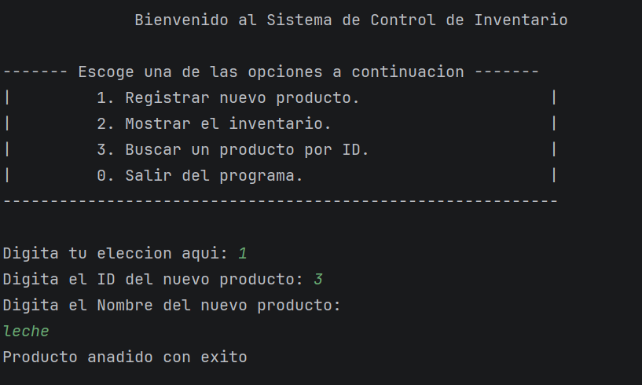
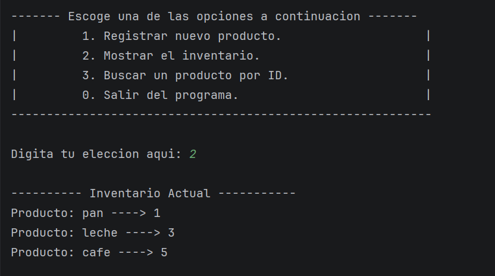
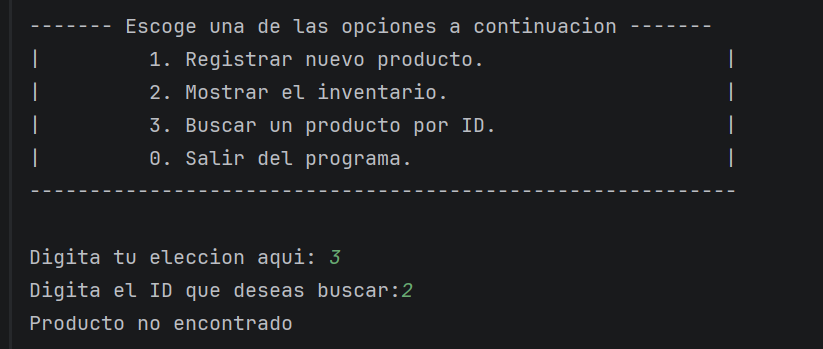
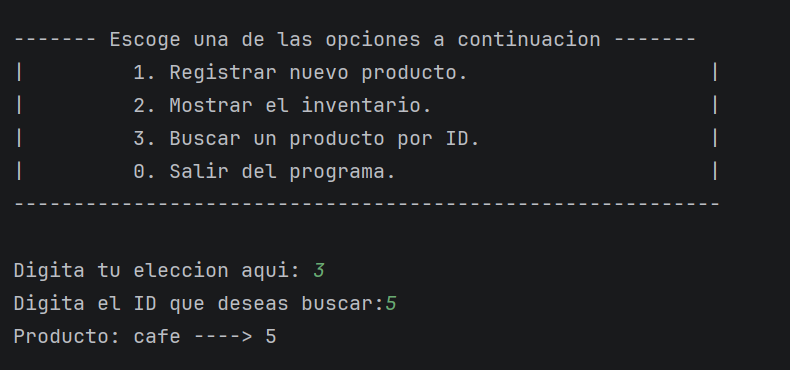
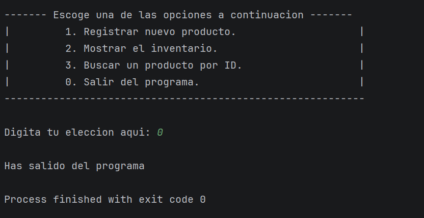

# Proyecto de arbol

Este proyecto tiene como objetivo simular un sistema de inventario utilizando la estructura de 
datos de un arbol implementado desde cero. El programa tiene las utilidades basicas de anadir nuevos
nodos al arbol (registrarProducto), mostrar el inventario (recorrerEnOrden) y buscar productos (buscarPorId).

# Clases implementadas

## 1. Producto.
Representa el TDA basico del programa. Un producto es representado por un nombre y un id numerico. Adicionalmente
contiene punteros a los nodos para los productos que tiene a la izquierda y a la derecha.

## 2. Arbol Inventario.
Implementa la logica de la estructura de datos del arbol. Sus metodos principales son el de registrar producto,
recorrer el arbol en orden y buscar un producto por su id.

### - Registrar producto:
Recorre el arbol empezando desde la raiz buscando el nodo apropiado al cual anadir el nodo del nuevo producto.
En este programa implementamos un arbol de busqueda binario, por lo que los productos con id's menores van a insertarse
a la izquierda, mientras que los de id's mayores iran a la derecha.

### - Recorrer en orden:
Recorre el arbol recursivamente desde la raiz, moviendose primero a los nodos a la izquierda y luego a los de la 
derecha para mostrar la estructura de menor a mayor en terminos de id.

### - Buscar por id:
Recorre los nodos evaluando si el id del nodo actual es igual al id buscado, y en caso afirmativo se deteine 
e imprime el nodo actual. Si el id actual es mayor, seguira buscando por la izquierda de dicho nodo. De lo contrario,
continuara buscando por la derecha.

## 3. Main.
Clase con la que interactua el usuario. Contiene metodos para mostrar el menu y llamar a los metodos subyacentes 
de la clase arbol. Funciona mediante un ciclo while y una estructura de switch que dirige el flujo de acuerdo 
a las elecciones del usuario.

# Muestra de ejecucion

Empezamos agregando productos al inventario mediante la opcion 1 del menu.

Despues de ingresar algunos productos, hacemos uso de la opcion 2 para mostrar el inventario. Como podemos ver
el inventario viene listado en orden ascendente por el numero de id.

Posteriormente, buscamos un id que no existe en el inventario actual, y como es de esperar recibimos el mensaje
de que dicho producto no existe en el catalogo actual.

Ahora buscamos un id que si existe, y el programa nos regresa el producto encontrado para ese id.

Finalmente, hacemos uso de la opcion para salir y el programa detiene su ejecucion.
